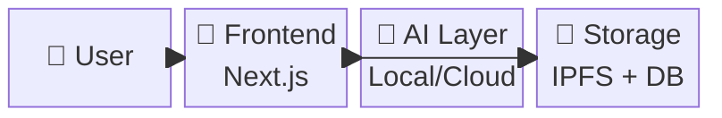
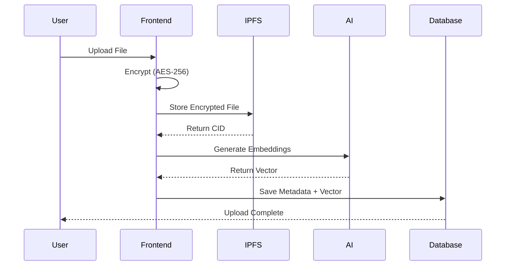
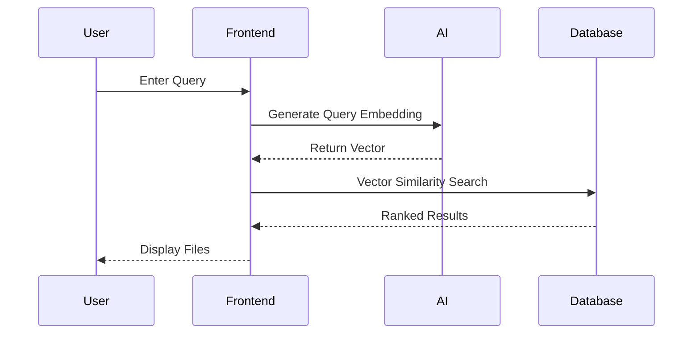

# LockNShare 🔐

> **Secure Decentralized File Sharing with AI-Powered Intelligence**  
> End-to-end encrypted file storage, Web3 authentication, IPFS hosting, semantic search, and intelligent security monitoring.

---

## 🌟 Quick Overview

LockNShare is a next-generation file sharing platform combining blockchain, decentralized storage, and AI for unparalleled security and privacy.

**Core Features:**
- 🔐 **End-to-End Encryption** - AES-256-GCM client-side encryption
- 🌐 **Decentralized Storage** - IPFS via Pinata
- 👛 **Web3 Authentication** - MetaMask wallet login
- 🤖 **AI-Powered Search** - Semantic file search with sentence transformers
- 🛡️ **Smart Security** - AI anomaly detection + trust scoring
- 📱 **Modern UI** - Responsive design with smooth animations

---

## 📋 System Architecture

### Block Diagram



### Complete Architecture

```
┌──────────────────────────────────────────────┐
│              USER (Browser)                  │
│           MetaMask Wallet Auth               │
└───────────────────┬──────────────────────────┘
                    │
┌───────────────────▼──────────────────────────┐
│          FRONTEND (Next.js/React)            │
│  • UI Components  • File Handler             │
│  • Upload/Download  • Search Interface       │
└───┬──────────────┬──────────────┬────────────┘
    │              │              │
    ▼              ▼              ▼
┌───────┐    ┌──────────┐    ┌──────────┐
│ IPFS  │    │  AI      │    │ Database │
│Files  │    │ Server   │    │Supabase  │
│Pinata │    │Local/Cloud│   │+ pgvector│
└───────┘    └──────────┘    └──────────┘
                │                    │
        ┌───────┴────────┐     ┌────┴─────┐
        │ Embeddings     │     │ Metadata │
        │ Classification │     │ Vectors  │
        └────────────────┘     │ Users    │
                               │ Files    │
                               └──────────┘
```

---

## 🔄 Key Workflows

### 1. File Upload Flow



### 2. Semantic Search Flow



### 3. File Access Flow

```
User Request → Check Permissions → Download from IPFS → Decrypt → Deliver ✅
```

### 4. Security Monitoring

```
Activity → Log → AI Analysis → Anomaly Detection → Alert (if suspicious) → Trust Score Update
```

---

## 🛠️ Technology Stack

### Frontend
- **Next.js 14** - React framework with App Router
- **TypeScript** - Type-safe development
- **TailwindCSS** - Utility-first styling
- **Framer Motion** - Smooth animations

### Backend & Infrastructure
- **Supabase** - PostgreSQL database + real-time
- **Pinata** - IPFS file storage
- **pgvector** - Vector similarity search

### AI Services
- **Local AI Server** - FastAPI (Python)
  - `sentence-transformers/all-MiniLM-L6-v2` - Embeddings (384-dim)
  - `facebook/bart-large-mnli` - Classification
- **Cloud Fallback** - HuggingFace Inference API

### Security
- **Encryption** - AES-256-GCM (Web Crypto API)
- **Authentication** - MetaMask Web3 signatures
- **Monitoring** - Hybrid AI + Rule-based detection

---

## 📦 Installation & Setup

### Prerequisites
- Node.js 18+ and npm
- MetaMask browser extension
- Supabase account (free tier)
- Pinata IPFS account (free tier)
- Python 3.13+ (for local AI server)

### Quick Start

```bash
# 1. Clone repository
git clone <your-repo-url>
cd locknshare

# 2. Install dependencies
npm install

# 3. Set up environment variables
cp .env.local.example .env.local
# Edit .env.local with your API keys

# 4. Run development server
npm run dev
```

### Environment Variables

Create `.env.local`:

```env
# Supabase
NEXT_PUBLIC_SUPABASE_URL=your_supabase_url
NEXT_PUBLIC_SUPABASE_ANON_KEY=your_anon_key
SUPABASE_SERVICE_ROLE_KEY=your_service_key

# Pinata IPFS
NEXT_PUBLIC_PINATA_API_KEY=your_api_key
NEXT_PUBLIC_PINATA_SECRET_KEY=your_secret
NEXT_PUBLIC_PINATA_JWT=your_jwt

# HuggingFace (for AI)
HUGGINGFACE_API_KEY=your_hf_key
NEXT_PUBLIC_HUGGINGFACE_API_KEY=your_hf_key

# AI Server (local or deployed)
NEXT_PUBLIC_AI_SERVER_URL=http://localhost:8000
AI_SERVER_FALLBACK=true

# App URL
NEXT_PUBLIC_APP_URL=http://localhost:3000
```

### Local AI Server Setup

The AI server provides faster, private embeddings and anomaly detection.

```bash
# Navigate to AI server directory
cd ai-server

# Install Python dependencies
pip install -r requirements.txt

# Run the server
python main.py

# Server starts on http://localhost:8000
```

**Key Features:**
- ✅ 50-300ms response time (vs 500-2000ms cloud)
- ✅ Privacy - data stays local
- ✅ No API costs
- ✅ Automatic fallback to cloud if unavailable

---

## 🚀 Deployment

### Frontend (Vercel)

1. Push code to GitHub
2. Import project in Vercel
3. Add environment variables
4. Deploy

### AI Server Options

**Option 1: Local (Demo/Development)**
```bash
# Run on your laptop
cd ai-server
python main.py

# Expose with ngrok
ngrok http 8000
```

**Option 2: Cloud (Production)**
- Railway.app (~$5/month)
- Render.com (~$7/month)
- Fly.io (~$3/month)

**Option 3: Cloud Fallback Only**
- Use `AI_SERVER_FALLBACK=true`
- All requests go to HuggingFace API
- No local server needed

---

## 🔐 Security Features

### Encryption
- **Client-Side**: AES-256-GCM encryption before upload
- **Zero-Knowledge**: Server never sees plaintext
- **Key Management**: Unique keys per file, shared securely

### Authentication
- **Web3 Based**: MetaMask signature verification
- **No Passwords**: Cryptographic signatures only
- **Session Management**: Secure JWT tokens

### AI Anomaly Detection

**Hybrid System:**
1. **Rule-Based (Fast)**
   - High frequency detection (>50 actions/hour)
   - Odd hours activity (2 AM - 5 AM)
   - New location access
   - Rapid downloads

2. **AI-Powered (Smart)**
   - Zero-shot classification
   - Context-aware analysis
   - Behavioral pattern detection
   - Confidence scoring

**Response Levels:**
- ✅ Normal (>80% confidence) → Log only → Trust +5
- 🟡 Suspicious (>50%) → Notify user → Trust -25
- 🟠 Threat (>50%) → Notify admin → Trust -50
- 🔴 Critical → Block action → Trust -100

### Trust Score System
- **Range**: 0-100
- **80-100**: Full access
- **50-79**: Normal with monitoring
- **20-49**: Restricted access
- **0-19**: Account review required

---

## 🎯 Key Features Explained

### 1. Semantic Search

Traditional search finds exact keyword matches. Semantic search understands meaning.

**Example:**
- **Search:** "project presentation slides"
- **Finds:** "Q4_Marketing_Deck.pptx", "Team_Proposal.pdf", "Product_Demo.ppt"
- **Why:** AI understands "presentation" ≈ "deck" ≈ "slides"

**How it works:**
1. Files converted to 384-dimensional vectors
2. Query converted to same vector space
3. Cosine similarity finds close matches
4. Results ranked by relevance

### 2. File Sharing

**Process:**
1. Owner selects file and recipient username
2. System shares encryption key with recipient
3. Recipient can access file with granted permissions
4. Owner can revoke access anytime

**Permission Levels:**
- Owner: Full control
- Editor: View, download, share
- Viewer: View, download only

### 3. Decentralized Storage (IPFS)

**Benefits:**
- No single point of failure
- Censorship resistant
- Content-addressed (CID)
- Files persist across network

**How it works:**
1. File uploaded to IPFS via Pinata
2. Receives unique CID (Content Identifier)
3. CID stored in database
4. File retrieved using CID anytime

---

## 📊 Performance

### Local AI Server
- **Embeddings**: 50-300ms
- **Classification**: 300-500ms
- **Uptime**: Dependent on laptop/server

### Cloud API Fallback
- **Embeddings**: 500-2000ms
- **Classification**: 1000-2000ms
- **Uptime**: 99.9%

### Database Queries
- **Vector Search**: <100ms
- **Metadata Fetch**: <50ms
- **File List**: <100ms

---

## 🧪 Development

### Run Development Server

```bash
# Frontend only
npm run dev

# Frontend + AI server (concurrent)
npm run dev:ai

# AI server only
cd ai-server && python main.py
```

### Test AI Server

```bash
# Check health
curl http://localhost:8000/health

# Test embeddings
curl -X POST http://localhost:8000/embeddings \
  -H "Content-Type: application/json" \
  -d '{"text": "test document"}'

# Test anomaly detection
curl -X POST http://localhost:8000/anomaly \
  -H "Content-Type: application/json" \
  -d '{"summary": "User performed 50 uploads in 1 hour"}'
```

---

## 🐛 Troubleshooting

### Common Issues

**1. AI Server Not Responding**
```bash
# Check if running
curl http://localhost:8000/health

# Restart server
cd ai-server
python main.py
```

**2. CORS Errors**
- Update `ALLOWED_ORIGINS` in `.env` or `ai-server/.env`
- Add your Vercel URL to allowed origins
- Restart AI server

**3. Memory Issues (Laptop)**
- BART model requires ~2-3GB RAM
- Close unnecessary applications
- Or disable classifier (embeddings still work)

**4. Embeddings Using Cloud Instead of Local**
- Check AI server is running
- Verify `NEXT_PUBLIC_AI_SERVER_URL` is correct
- Check timeout (increased to 30s for ngrok)

---

## 📚 API Documentation

### AI Server Endpoints

**Health Check**
```
GET /health
Response: {"status": "healthy", "models_loaded": {...}}
```

**Generate Embeddings**
```
POST /embeddings
Body: {"text": "your text here"}
Response: {"embedding": [0.1, 0.2, ...], "dimensions": 384}
```

**Anomaly Detection**
```
POST /anomaly
Body: {"summary": "activity description"}
Response: {
  "label": "normal user activity",
  "confidence": 0.85,
  "all_scores": {...}
}
```

---

## 🔮 Future Enhancements

- [ ] File versioning
- [ ] Collaborative editing
- [ ] Mobile app (React Native)
- [ ] Enhanced AI models
- [ ] Blockchain integration for audit trail
- [ ] Team workspaces
- [ ] Advanced access controls

---

## 📄 License

This project is licensed under the MIT License.

---

## 🙏 Acknowledgments

- **Next.js** - React framework
- **Supabase** - Backend infrastructure
- **Pinata** - IPFS storage
- **HuggingFace** - AI models
- **MetaMask** - Web3 authentication
- **Vercel** - Hosting platform

---

## 📧 Support

For issues, questions, or contributions, please open an issue on GitHub.

---

**Built with ❤️ using Next.js, AI, and Web3**
