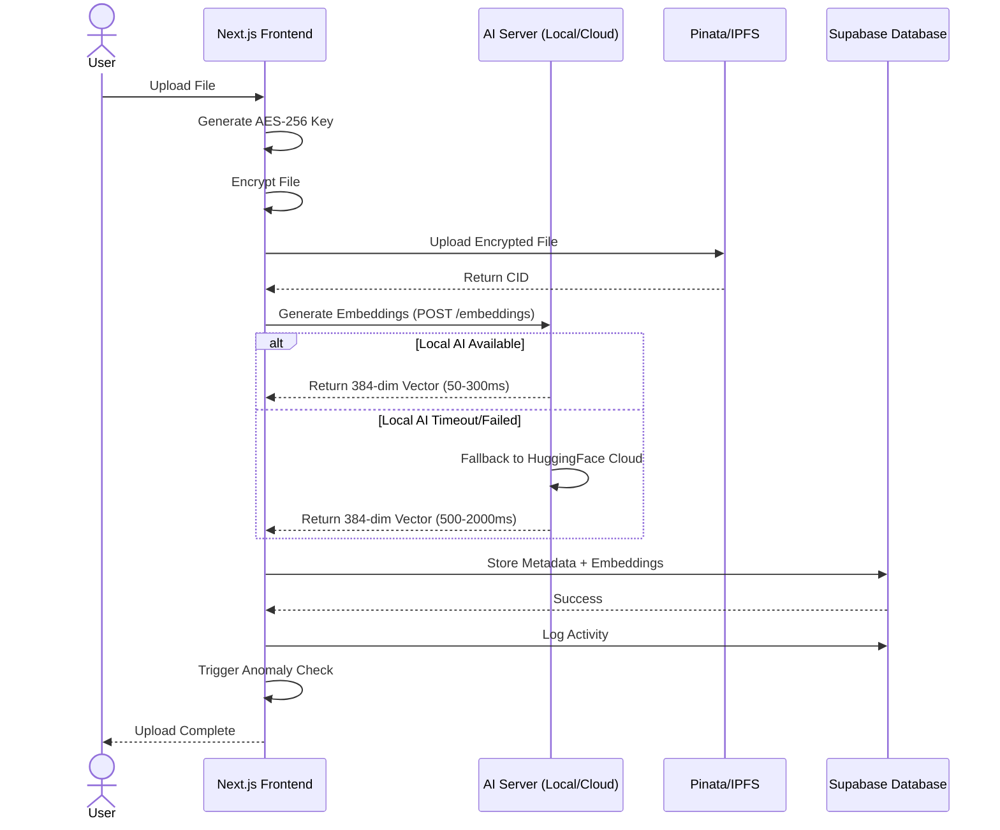
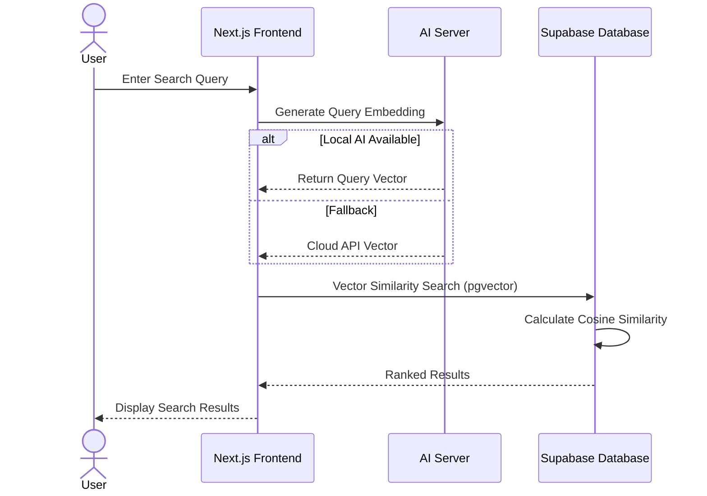
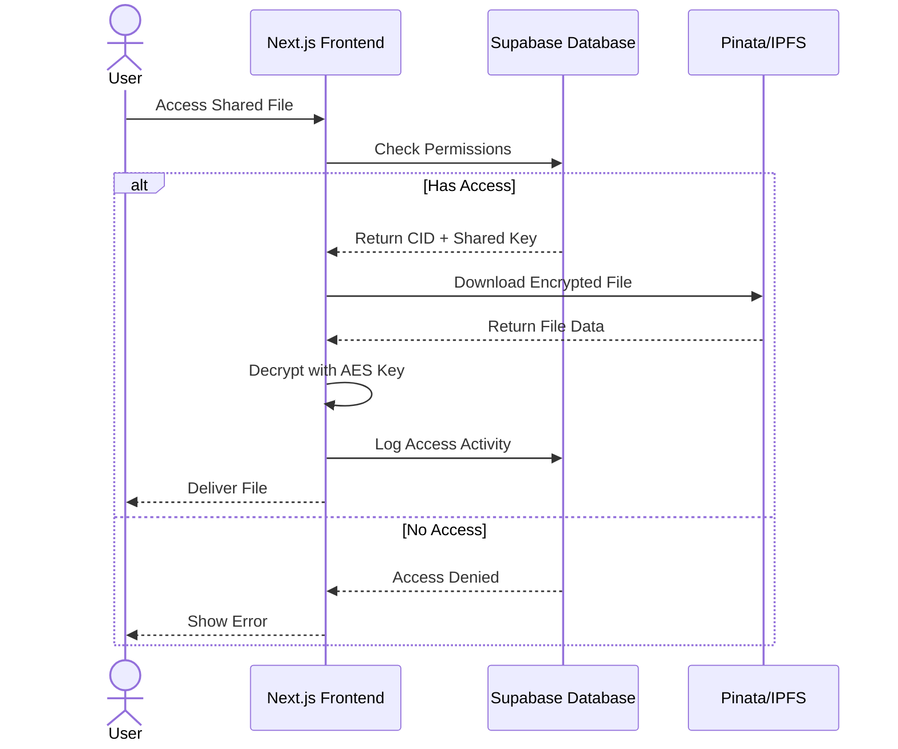
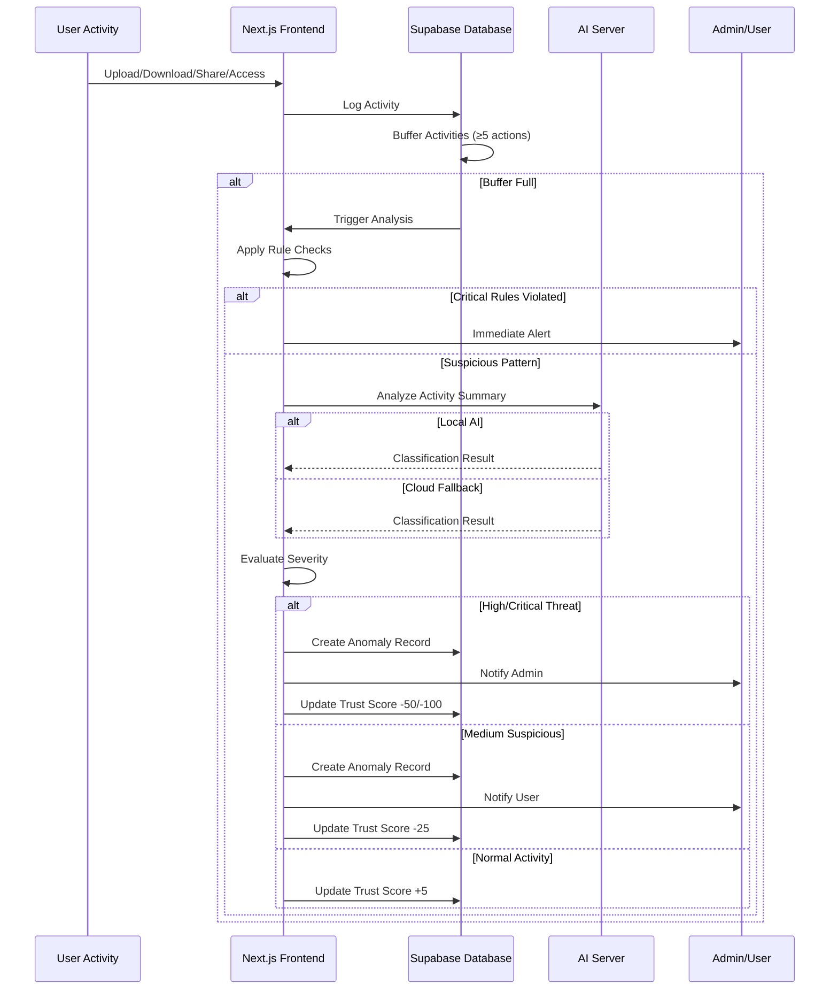
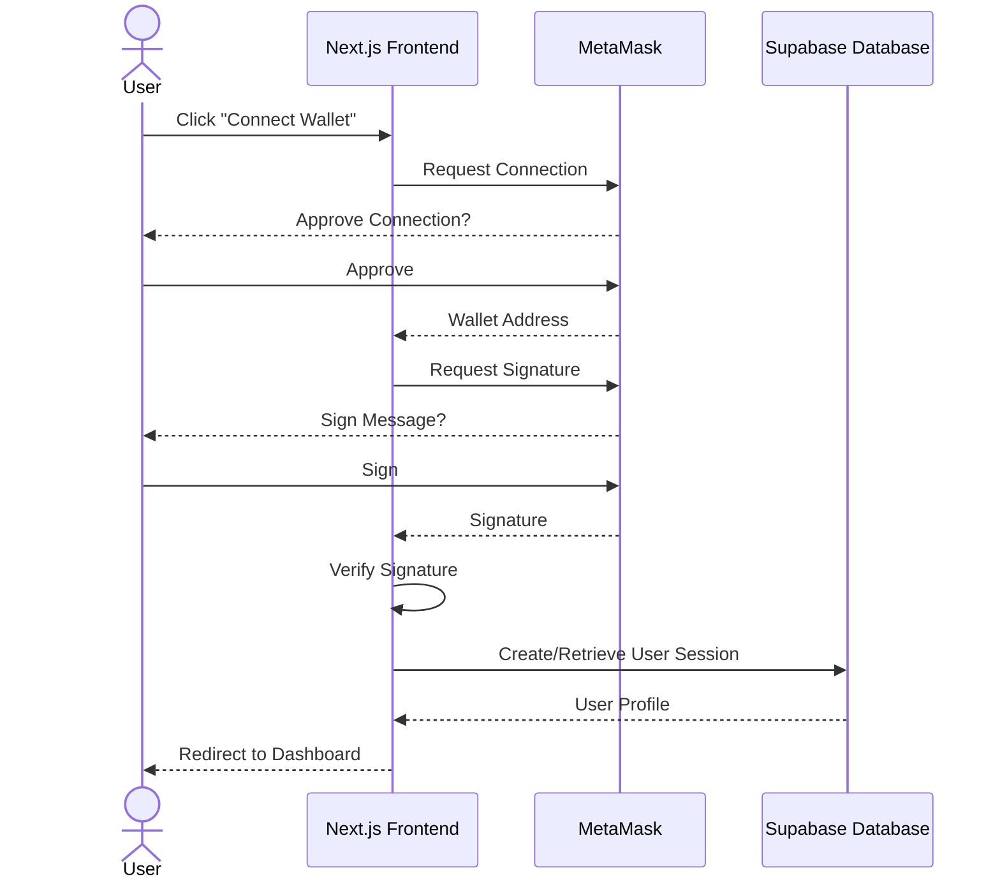
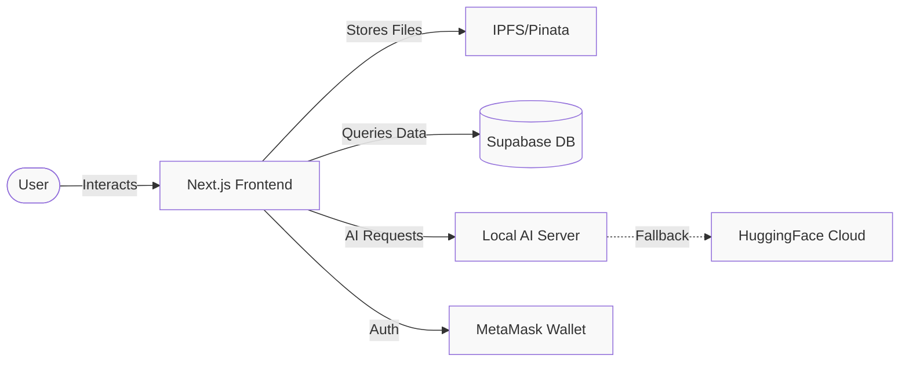

# LockNShare Sequence Diagrams

Simple sequence diagrams showing how different components interact in the LockNShare system.

---

## 1. File Upload with AI Embeddings



### How File Upload Works

**Step-by-Step Process:**

1. **User Initiates Upload**
   - User selects a file from their device through the web interface
   - Frontend receives the file and prepares for processing

2. **Client-Side Encryption**
   - Frontend generates a random AES-256-GCM encryption key
   - This key is unique to this file and stored securely
   - The entire file is encrypted in the browser before leaving the user's device
   - **Security**: File is encrypted before any network transmission

3. **IPFS Storage**
   - Encrypted file is uploaded to IPFS via Pinata gateway
   - IPFS returns a Content Identifier (CID) - a unique hash of the file
   - This CID serves as the decentralized address for retrieving the file
   - **Benefit**: File is stored on decentralized network, not centralized servers

4. **AI Embedding Generation (Smart Fallback)**
   - Frontend sends file metadata (name, description) to AI server
   - **Primary Path**: Attempts to use local AI server (localhost:8000)
     - If successful: Gets embedding in 50-300ms
     - If fails/timeout: Automatically falls back to cloud
   - **Fallback Path**: Uses HuggingFace Cloud API
     - Takes 500-2000ms but always reliable
   - **Output**: 384-dimensional vector representing the file's semantic meaning

5. **Database Storage**
   - Stores in Supabase database:
     - File metadata (name, size, type, owner)
     - IPFS CID (for retrieval)
     - Encrypted AES key (for decryption)
     - Embedding vector (for semantic search)
     - Timestamps and permissions

6. **Activity Logging**
   - Records the upload activity with:
     - User ID, timestamp, IP address
     - Action type (upload), file ID
   - This log feeds into anomaly detection system

7. **Security Check Trigger**
   - Automatically triggers anomaly detection analysis
   - Checks if upload pattern is suspicious
   - Updates user's trust score based on behavior

**Key Security Features:**
- ✅ End-to-end encryption (file encrypted before upload)
- ✅ Decentralized storage (no single point of failure)
- ✅ Smart AI fallback (always works, even if local server down)
- ✅ Automatic anomaly detection (catches suspicious uploads)


---

## 2. Semantic File Search



### How Semantic Search Works

**Step-by-Step Process:**

1. **User Enters Search Query**
   - User types a natural language search query (e.g., "financial reports from Q3")
   - No need for exact filename matches - semantic understanding works

2. **Query Embedding Generation**
   - Frontend sends query text to AI server
   - **Local AI (Preferred)**: 
     - Uses `sentence-transformers/all-MiniLM-L6-v2` model
     - Generates 384-dimensional vector in ~50-100ms
     - Data stays on local machine (privacy)
   - **Cloud Fallback**:
     - If local unavailable/timeout, uses HuggingFace API
     - Same model ensures consistent results
     - Takes longer but always works

3. **Vector Similarity Search**
   - Frontend sends query vector to Supabase database
   - Database uses **pgvector** extension for efficient search
   - **Cosine Similarity Calculation**:
     - Compares query vector with all file embeddings
     - Formula: `similarity = (A · B) / (||A|| × ||B||)`
     - Result ranges from -1 (opposite) to 1 (identical)
     - Typically considers matches > 0.7 as relevant

4. **Ranking Results**
   - Files sorted by similarity score (highest first)
   - Additional filters applied:
     - User has access to the file
     - File is not deleted
     - Optional: filter by file type, date, owner

5. **Display to User**
   - Shows ranked list with:
     - File name and preview
     - Similarity score (relevance %)
     - Owner and sharing status
     - Upload date

**Why Semantic Search is Powerful:**

- 🎯 **Intent Understanding**: Finds "budget spreadsheet" even if you search "financial planning"
- 🔍 **Context Aware**: Understands relationships between words
- 📁 **Beyond Keywords**: Doesn't rely on exact filename matches
- 🚀 **Fast**: Vector search is extremely efficient even with thousands of files
- 🔐 **Secure**: Only searches files user has permission to access

**Example:**
- Search: "project presentation slides"
- Finds: "Q4_Marketing_Deck.pptx", "Team_Proposal.pdf", "Product_Demo.ppt"
- Why: Semantic understanding of "presentation" ≈ "deck" ≈ "slides"


---

## 3. File Access with Decryption



### How File Access & Decryption Works

**Step-by-Step Process:**

1. **User Requests File Access**
   - User clicks on a shared file they want to access
   - Frontend captures the file ID and user's identity

2. **Permission Verification**
   - Frontend queries Supabase database for access rights
   - **Checks**:
     - Is user the owner of the file?
     - Has the file been shared with this user?
     - Is the sharing still active (not expired/revoked)?
     - What permission level? (view, download, edit)

3. **Access Decision**
   
   **If Access Granted:**
   - Database returns:
     - IPFS CID (where file is stored)
     - Shared encryption key (AES-256 key for this file)
     - File metadata (name, size, type)
   
   **If Access Denied:**
   - Returns error message
   - Logs unauthorized access attempt
   - May trigger security alert if repeated

4. **File Retrieval from IPFS**
   - Frontend uses CID to fetch file from IPFS
   - Contacts Pinata gateway with the CID
   - Downloads encrypted file data
   - **Decentralized**: File retrieved from distributed network
   - **Resilient**: Multiple nodes can serve the same file

5. **Client-Side Decryption**
   - Frontend receives encrypted file data
   - Uses the shared AES-256-GCM key to decrypt
   - **Decryption happens in browser** - file never sent decrypted over network
   - Validates integrity (GCM authentication ensures file hasn't been tampered)

6. **Integrity Verification**
   - Checks file hash matches original
   - Verifies encryption authentication tag
   - If corrupted: Shows error, doesn't deliver file

7. **Activity Logging**
   - Records file access event:
     - Who accessed (user ID)
     - What file (file ID)
     - When (timestamp)
     - Where from (IP address, location)
   - Feeds anomaly detection system

8. **File Delivery**
   - Decrypted file presented to user
   - User can view/download the original file
   - All decryption happens locally - maximum security

**Security Features:**

- 🔐 **Zero-Knowledge Architecture**: Server never has decrypted file
- 🔑 **Key Sharing**: Only authorized users get decryption keys
- 🛡️ **Tamper Detection**: GCM mode ensures file integrity
- 📝 **Audit Trail**: Every access is logged for security monitoring
- 🚫 **Granular Control**: Owner can revoke access anytime

**Access Control Types:**

| User Type | Can View | Can Download | Can Share | Can Delete |
|-----------|----------|--------------|-----------|------------|
| Owner | ✅ | ✅ | ✅ | ✅ |
| Editor | ✅ | ✅ | ✅ | ❌ |
| Viewer | ✅ | ✅ | ❌ | ❌ |
| No Access | ❌ | ❌ | ❌ | ❌ |


---

## 4. AI Anomaly Detection



### How AI Anomaly Detection Works

**Step-by-Step Process:**

1. **Activity Capture**
   - Every user action is logged in real-time:
     - File uploads, downloads, views, shares
     - Login attempts, permission changes
     - Search queries, profile updates
   - Each logged with: user ID, timestamp, IP address, action type, metadata

2. **Activity Buffering**
   - System maintains a rolling buffer of recent activities
   - **Threshold**: Analysis triggers when ≥5 activities accumulated
   - **Window**: Looks at last 24-48 hours of user behavior
   - **Purpose**: Build context for pattern analysis

3. **Rule-Based Analysis (Fast First Pass)**
   
   **Frequency Check:**
   - Detects: >50 actions per hour
   - Flag: Potential automation/bot activity
   
   **Time-Based Check:**
   - Detects: Activity during odd hours (2 AM - 5 AM)
   - Flag: Unusual access patterns
   
   **Location Check:**
   - Detects: New IP address or country
   - Compare: Against user's historical locations
   - Flag: Potential account compromise
   
   **Pattern Check:**
   - Detects: Rapid sequential downloads
   - Detects: Mass file sharing
   - Flag: Potential data exfiltration

4. **Severity Assessment (Rules)**
   
   **Critical** (Immediate Response):
   - Multiple rules violated simultaneously
   - Known malicious patterns
   - Action: Immediate alert, possible block
   
   **Medium/Low** (AI Analysis Required):
   - Unclear if malicious or legitimate
   - Action: Proceed to AI analysis

5. **Activity Summarization**
   - Creates natural language summary:
   ```
   "User performed 35 actions in 24 hours: 
   25 uploads, 0 downloads, 10 views, 0 shares.
   Activity from 7 different locations.
   Peak activity at 3 AM local time."
   ```

6. **AI Classification**
   
   **Local AI Path (Preferred):**
   - Sends summary to `http://localhost:8000/anomaly`
   - Uses `facebook/bart-large-mnli` model
   - Zero-shot classification against 4 categories:
     1. "normal user activity"
     2. "suspicious behavior"
     3. "potential security threat"
     4. "data exfiltration attempt"
   - Returns: Label + confidence score (0-1)
   - Time: ~300-500ms
   
   **Cloud Fallback:**
   - If local times out (>15s) or unavailable
   - Uses HuggingFace Inference API
   - Same model = same quality results
   - Time: ~1000-2000ms

7. **Confidence Evaluation**
   
   **High Confidence (>80%):**
   - Trust the AI classification
   - Proceed with appropriate action
   
   **Medium Confidence (50-80%):**
   - Flag for review
   - Combine with rule-based results
   
   **Low Confidence (<50%):**
   - Treat as normal unless rules flagged it

8. **Severity Determination & Response**
   
   **✅ Normal Activity (Confidence >80%):**
   - Action: Log only
   - Trust Score: +5
   - Effect: None
   
   **🟡 Medium Severity (Suspicious, Confidence >50%):**
   - Action: Notify user via email/dashboard
   - Trust Score: -25
   - Effect: Alert appears in security dashboard
   - Example: "Unusual login from new location detected"
   
   **🟠 High Severity (Threat, Confidence >50%):**
   - Action: Notify admin AND user
   - Trust Score: -50
   - Effect: Increased monitoring, possible temporary restrictions
   - Example: "Potential unauthorized access detected"
   
   **🔴 Critical Severity (Breach, Confidence >50% OR Critical Rules):**
   - Action: Block action + notify admin immediately
   - Trust Score: -100
   - Effect: Account temporarily suspended, all activity logged
   - Example: "Data exfiltration attempt blocked"

9. **Database Recording**
   - Creates anomaly record with:
     - Anomaly ID, user ID, severity level
     - AI label and confidence score
     - Activity summary and context
     - Detection timestamp
     - Resolution status (pending/resolved)

10. **Trust Score Update**
    - Running score from 0-100
    - Affects user privileges:
      - 80-100: Full access
      - 50-79: Normal access with monitoring
      - 20-49: Restricted access
      - 0-19: Account review required

**Why Hybrid Detection is Powerful:**

🚀 **Speed**: Rule-based catches obvious threats instantly
🧠 **Intelligence**: AI understands context and nuance
🎯 **Accuracy**: Combines both for fewer false positives
🔄 **Adaptive**: AI learns from patterns, not just rules
📊 **Contextual**: Considers user's normal behavior patterns

**Real-World Examples:**

**Example 1: Legitimate Power User**
- Activity: Uploaded 50 files in 1 hour
- Rules: Flags high frequency ⚠️
- AI Analysis: "normal user activity" (confidence: 85%)
- Result: ✅ No alert (AI overrides rule)
- Reason: User regularly uploads batches, this is their pattern

**Example 2: Compromised Account**
- Activity: Downloads at 3 AM from new country
- Rules: Flags location + time ⚠️⚠️
- AI Analysis: "potential security threat" (confidence: 78%)
- Result: 🟠 High alert, notify admin
- Reason: Both rules and AI agree on threat

**Example 3: Data Breach Attempt**
- Activity: Downloaded entire file library in 10 minutes
- Rules: Critical pattern violation 🚨
- AI Analysis: "data exfiltration attempt" (confidence: 92%)
- Result: 🔴 Block + notify + log
- Reason: Clear malicious intent detected


---

## 5. Authentication Flow



### How MetaMask Authentication Works

**Step-by-Step Process:**

1. **User Initiates Connection**
   - User arrives at LockNShare landing page
   - Clicks "Connect Wallet" button
   - Frontend detects if MetaMask is installed in browser

2. **MetaMask Connection Request**
   - Frontend calls `window.ethereum.request({ method: 'eth_requestAccounts' })`
   - **MetaMask Extension Activates**:
     - Shows popup to user
     - Displays the app requesting connection
     - Lists wallet addresses available
   
3. **User Approval - Connection**
   - **User Action Required**: Must explicitly approve connection
   - User selects which wallet address to use
   - Clicks "Connect" in MetaMask popup
   - **Security**: User always in control of what apps connect

4. **Wallet Address Retrieved**
   - MetaMask returns the Ethereum wallet address
   - Format: 42-character hexadecimal (e.g., `0x742d35Cc6634C0532925a3b844Bc9e7595f0bEb`)
   - This address serves as the user's unique identifier
   - **Privacy**: No personal information shared, just public address

5. **Signature Request**
   - Frontend generates a challenge message:
     ```
     "Sign this message to authenticate with LockNShare.
     Nonce: [random-string]
     Timestamp: [current-time]"
     ```
   - Requests signature via `personal_sign` method
   - **MetaMask Shows Signature Request**:
     - User sees the exact message being signed
     - Clearly states "This will not cost gas"
     - Shows which account is signing

6. **User Signs Message**
   - **User Action Required**: Must approve signing
   - User clicks "Sign" in MetaMask
   - MetaMask creates cryptographic signature using private key
   - **Security**: Private key never leaves MetaMask
   - **Cost**: Signing is free (no transaction, no gas fees)

7. **Signature Verification**
   - Frontend receives the signature
   - **Cryptographic Verification**:
     - Uses `ecrecover` to derive signer address from signature
     - Confirms it matches the connected wallet address
     - Validates timestamp (prevents replay attacks)
     - Checks nonce (ensures message freshness)
   - **Result**: Proves user controls the wallet's private key

8. **Session Creation**
   - Frontend sends verified address to Supabase
   - **Database Check**:
     - New user? Create user profile
     - Existing user? Retrieve profile and preferences
   - Creates secure session token (JWT)
   - Stores session in browser (httpOnly cookie)

9. **User Profile Retrieved**
   - Fetches user's data:
     - Wallet address
     - Display name (optional)
     - Trust score
     - File ownership records
     - Sharing permissions
     - Activity history

10. **Redirect to Dashboard**
    - User logged in successfully
    - Session established
    - Redirected to main dashboard
    - Can now upload, search, share files

**Security Features:**

🔐 **No Passwords**: Uses cryptographic signatures instead
🎯 **Decentralized**: No central authority controls authentication
🔑 **User Control**: Private keys never shared with application
🛡️ **Replay Protection**: Nonces and timestamps prevent replay attacks
✅ **Verifiable**: Signatures cryptographically provable
🚫 **No Gas Fees**: Signing messages is free

**Why Web3 Authentication is Better:**

| Traditional Auth | Web3/MetaMask Auth |
|------------------|-------------------|
| Username + Password | Wallet Signature |
| Stored in database | No password storage |
| Can be phished | Phishing resistant |
| Forgot password = locked out | Control via wallet |
| Centralized | Decentralized |
| Requires email | Pseudonymous |

**Common User Experience:**

**First Time User:**
1. Install MetaMask extension (if needed)
2. Create wallet or import existing
3. Connect to LockNShare
4. Sign authentication message
5. Profile created automatically
6. Ready to use!

**Returning User:**
1. Click "Connect Wallet"
2. MetaMask remembers previous connection
3. One-click approve (if previously connected)
4. Sign message
5. Instantly logged in!

**Security Considerations:**

✅ **What Users Should Verify:**
- App URL is correct (avoid phishing sites)
- Message content makes sense
- No transaction fees mentioned (signing is free)
- Using correct wallet/account

⚠️ **Red Flags (Don't Sign):**
- Message asks to "transfer funds"
- Unknown website
- Unexpected signing request
- Message contains smart contract calls

**Technical Details:**

**Signature Format (EIP-191):**
```
"\x19Ethereum Signed Message:\n" + len(message) + message
```

**Recovery Process:**
```javascript
const recoveredAddress = ethers.utils.verifyMessage(message, signature)
if (recoveredAddress === walletAddress) {
  // Valid signature, user authenticated
}
```

**Session Management:**
- JWT token contains: wallet address, issued timestamp, expiry
- Token valid for: 7 days (configurable)
- Refresh: Automatic silent re-sign if user active
- Logout: Clears session token


---

## Component Interaction Overview



---

## Quick Reference

### Sequence Diagram Notation

| Symbol | Meaning |
|--------|---------|
| `→` Solid Arrow | Synchronous request/call |
| `-->>` Dashed Arrow | Response/return |
| `alt/else` | Conditional logic |
| `participant` | System component |
| `actor` | Human user |

### Key Interactions

| Flow | Components Involved | Purpose |
|------|-------------------|---------|
| **Upload** | User → Frontend → AI → IPFS → DB | Encrypt, store, and index files |
| **Search** | User → Frontend → AI → DB | Find files using semantic search |
| **Access** | User → Frontend → DB → IPFS | Retrieve and decrypt shared files |
| **Security** | Activity → Frontend → AI → DB | Detect and respond to threats |
| **Auth** | User → Frontend → MetaMask → DB | Secure wallet-based login |

### Response Times

| Operation | Local AI | Cloud API |
|-----------|----------|-----------|
| Embeddings | 50-300ms | 500-2000ms |
| Classification | 300-500ms | 1000-2000ms |
| Total (with fallback) | ~30s timeout | Always works |

---

*Sequence diagrams showing component interactions in LockNShare - November 2025*
