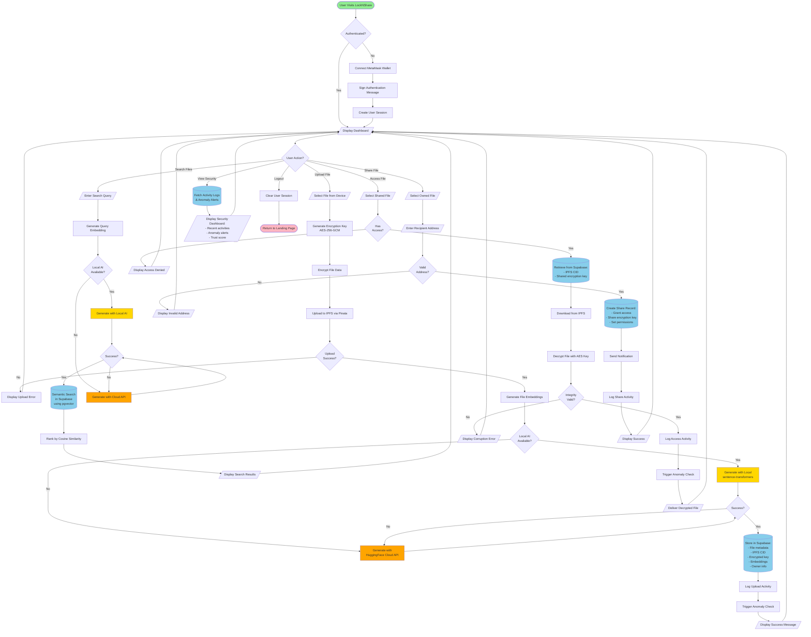

# LockNShare System & AI Flowcharts

This document provides comprehensive flowcharts showing how the LockNShare system works, including the AI-powered anomaly detection workflow.

---

## 1. Complete System Workflow

This flowchart shows the entire file sharing process from user authentication to file access.



---

## 2. AI-Powered Anomaly Detection Workflow

This flowchart details how the system detects suspicious activities using hybrid rule-based and AI analysis.

```mermaid
flowchart TD
    Start([Activity Triggered:<br/>Upload/Download/Share/Access]) --> LogActivity[Log Activity to Database]
    
    LogActivity --> ActivityData[(Store Activity:<br/>- User ID<br/>- Action type<br/>- Timestamp<br/>- IP address<br/>- File ID<br/>- Metadata)]
    
    ActivityData --> BufferCheck{Activity<br/>Buffer Full?<br/>≥5 actions}
    
    BufferCheck -->|No| WaitBuffer[Wait for More Activities]
    WaitBuffer --> End1([Continue Normal Operation])
    
    BufferCheck -->|Yes| FetchRecent[(Fetch Recent Activities<br/>Last 24-48 hours)]
    
    FetchRecent --> RuleAnalysis{Rule-Based<br/>Analysis}
    
    %% Rule-based checks
    RuleAnalysis --> CheckFreq{Unusual<br/>Frequency?<br/>>50 actions/hr}
    CheckFreq -->|Yes| FlagFreq[Flag: High Frequency]
    CheckFreq -->|No| CheckTime{Unusual<br/>Time?<br/>2AM-5AM}
    
    CheckTime -->|Yes| FlagTime[Flag: Odd Hours]
    CheckTime -->|No| CheckLocation{Unusual<br/>Location?<br/>New IP/Country}
    
    CheckLocation -->|Yes| FlagLocation[Flag: New Location]
    CheckLocation -->|No| CheckPattern{Unusual<br/>Pattern?<br/>Rapid downloads}
    
    CheckPattern -->|Yes| FlagPattern[Flag: Suspicious Pattern]
    CheckPattern -->|No| RulesPass[No Rule Violations]
    
    FlagFreq --> RuleSeverity{Severity<br/>Score}
    FlagTime --> RuleSeverity
    FlagLocation --> RuleSeverity
    FlagPattern --> RuleSeverity
    
    RuleSeverity -->|High| ImmediateAlert[Create High-Severity Alert]
    RuleSeverity -->|Medium| ProceedAI[Proceed to AI Analysis]
    RuleSeverity -->|Low| ProceedAI
    RulesPass --> ProceedAI
    
    %% AI Analysis
    ProceedAI --> SummarizeActivity[Summarize Activity:<br/>'User performed X actions<br/>in Y hours: A uploads,<br/>B downloads, C views...<br/>Activity from N locations']
    
    SummarizeActivity --> TryLocalAI{Local AI<br/>Server<br/>Available?}
    
    TryLocalAI -->|Yes| LocalAI[POST to Local AI Server<br/>http://localhost:8000/anomaly]
    TryLocalAI -->|No| CloudAI[Use HuggingFace<br/>Cloud API]
    
    LocalAI --> LocalTimeout{Response<br/>within 15s?}
    LocalTimeout -->|No| CloudAI
    LocalTimeout -->|Yes| ClassifyLocal[Zero-Shot Classification<br/>facebook/bart-large-mnli]
    
    CloudAI --> ClassifyCloud[Zero-Shot Classification<br/>facebook/bart-large-mnli]
    
    ClassifyLocal --> Labels{Classify against labels:<br/>1. normal user activity<br/>2. suspicious behavior<br/>3. potential security threat<br/>4. data exfiltration attempt}
    ClassifyCloud --> Labels
    
    Labels --> GetScores[Get Confidence Scores<br/>for Each Label]
    
    GetScores --> TopLabel{Top Label?}
    
    TopLabel -->|normal user<br/>activity| CheckConfidence1{Confidence<br/>>80%?}
    TopLabel -->|suspicious<br/>behavior| CheckConfidence2{Confidence<br/>>50%?}
    TopLabel -->|security<br/>threat| CheckConfidence3{Confidence<br/>>50%?}
    TopLabel -->|data<br/>exfiltration| CheckConfidence4{Confidence<br/>>50%?}
    
    CheckConfidence1 -->|Yes| NoAnomaly[No Anomaly Detected]
    CheckConfidence1 -->|No| LowConfAnomaly[Low Confidence Anomaly]
    
    CheckConfidence2 -->|Yes| MediumAnomaly[Medium Severity Anomaly]
    CheckConfidence3 -->|Yes| HighAnomaly[High Severity Anomaly]
    CheckConfidence4 -->|Yes| CriticalAnomaly[Critical Severity Anomaly]
    
    CheckConfidence2 -->|No| NoAnomaly
    CheckConfidence3 -->|No| MediumAnomaly
    CheckConfidence4 -->|No| HighAnomaly
    
    %% Create Anomaly Records
    LowConfAnomaly --> CreateRecord1[(Create Anomaly Record:<br/>Severity: Low<br/>Type: suspicious_pattern<br/>AI Label + Confidence<br/>Activity summary)]
    
    MediumAnomaly --> CreateRecord2[(Create Anomaly Record:<br/>Severity: Medium<br/>Type: suspicious_login<br/>AI Label + Confidence<br/>Activity summary)]
    
    HighAnomaly --> CreateRecord3[(Create Anomaly Record:<br/>Severity: High<br/>Type: security_threat<br/>AI Label + Confidence<br/>Activity summary)]
    
    CriticalAnomaly --> CreateRecord4[(Create Anomaly Record:<br/>Severity: Critical<br/>Type: data_breach_attempt<br/>AI Label + Confidence<br/>Activity summary)]
    
    ImmediateAlert --> CreateRecord3
    
    %% Notifications & Actions
    CreateRecord1 --> LogOnly[Log for Review]
    CreateRecord2 --> NotifyUser[Send User Notification]
    CreateRecord3 --> NotifyAdmin[Notify Admin & User]
    CreateRecord4 --> BlockAction[Block User + Notify Admin]
    
    NoAnomaly --> UpdateTrust1[Update Trust Score: +5]
    LogOnly --> UpdateTrust2[Update Trust Score: -10]
    NotifyUser --> UpdateTrust3[Update Trust Score: -25]
    NotifyAdmin --> UpdateTrust4[Update Trust Score: -50]
    BlockAction --> UpdateTrust5[Update Trust Score: -100]
    
    UpdateTrust1 --> SaveTrust[(Save Trust Score<br/>to Database)]
    UpdateTrust2 --> SaveTrust
    UpdateTrust3 --> SaveTrust
    UpdateTrust4 --> SaveTrust
    UpdateTrust5 --> SaveTrust
    
    SaveTrust --> DisplaySecurity[/Update Security Dashboard/]
    DisplaySecurity --> End2([Monitoring Continues])
    
    style Start fill:#90EE90
    style End1 fill:#90EE90
    style End2 fill:#90EE90
    style ActivityData fill:#87CEEB
    style FetchRecent fill:#87CEEB
    style CreateRecord1 fill:#87CEEB
    style CreateRecord2 fill:#87CEEB
    style CreateRecord3 fill:#87CEEB
    style CreateRecord4 fill:#87CEEB
    style SaveTrust fill:#87CEEB
    style LocalAI fill:#FFD700
    style ClassifyLocal fill:#FFD700
    style CloudAI fill:#FFA500
    style ClassifyCloud fill:#FFA500
    style NoAnomaly fill:#90EE90
    style LowConfAnomaly fill:#FFFF99
    style MediumAnomaly fill:#FFD700
    style HighAnomaly fill:#FFA500
    style CriticalAnomaly fill:#FF6B6B
    style BlockAction fill:#FF0000
```



---

## Flowchart Legend

### Shape Meanings

| Shape | Meaning | Usage |
|-------|---------|-------|
| **Rounded Rectangle** `([...])` | Start/End | Entry and exit points |
| **Rectangle** `[...]` | Process | Operations, computations, functions |
| **Diamond** `{...}` | Decision | Conditional branches, yes/no questions |
| **Parallelogram** `[/.../]` | Input/Output | User interactions, display messages |
| **Cylinder** `[(...)]` | Database | Data storage and retrieval |

### Color Coding

| Color | Meaning |
|-------|---------|
| 🟢 **Green** | Start/End points, Success states |
| 🔵 **Light Blue** | Database operations |
| 🟡 **Gold** | Local AI processing |
| 🟠 **Orange** | Cloud API fallback |
| 🟡 **Yellow** | Low severity alerts |
| 🟠 **Orange** | Medium/High severity alerts |
| 🔴 **Red** | Critical alerts, blocking actions |

---

## Key System Features Highlighted

### 1. Complete System Workflow

**Security Features:**
- End-to-end encryption (AES-256-GCM)
- MetaMask wallet authentication
- Decentralized IPFS storage
- Access control via shared keys

**AI Features:**
- Local-first embedding generation
- Semantic search with vector similarity
- Automatic fallback to cloud API

**User Experience:**
- Single dashboard for all operations
- Real-time security monitoring
- Seamless file sharing

### 2. Anomaly Detection Workflow

**Hybrid Detection:**
- **Rule-based**: Fast detection of known patterns
- **AI-powered**: Contextual analysis of user behavior

**Smart AI Fallback:**
- Tries local AI server first (faster, private)
- Falls back to cloud API (reliable backup)
- 15-second timeout for optimal UX

**Graduated Response:**
- **Low severity**: Log for review
- **Medium severity**: Notify user
- **High severity**: Notify admin
- **Critical severity**: Block action immediately

**Continuous Learning:**
- Trust score system
- Activity pattern analysis
- Adaptive thresholds

---

## Technical Implementation Notes

### Local AI Server
- **Model**: `facebook/bart-large-mnli` (1.6GB)
- **Endpoint**: `POST /anomaly`
- **Timeout**: 15 seconds
- **Response**: Classification labels + confidence scores

### Cloud API Fallback
- **Provider**: HuggingFace Inference API
- **Same model**: Consistent results
- **Use cases**: Local server down, timeout, or error

### Database Schema
```sql
-- Anomaly records
anomaly_records (
  id, user_id, anomaly_type, severity,
  description, detected_at, resolved,
  metadata (AI label, confidence, summary)
)

-- Activity logs
activity_logs (
  id, user_id, action, timestamp,
  ip_address, location, file_id, metadata
)
```

### Trust Score Calculation
- **Base score**: 100
- **Normal activity**: +5
- **Minor anomaly**: -10
- **Medium anomaly**: -25
- **High anomaly**: -50
- **Critical anomaly**: -100
- **Range**: 0-100

---

## Deployment Architecture

```
Production Setup:
┌─────────────────┐
│   Vercel        │ ← Next.js Application
│  (Next.js)      │
└────────┬────────┘
         │
         ├──────────────┐
         │              │
    ┌────▼─────┐   ┌───▼──────┐
    │ Supabase │   │  Pinata  │
    │(Database)│   │  (IPFS)  │
    └──────────┘   └──────────┘
         │
         │
    ┌────▼────────────────┐
    │   AI Server         │
    ├─────────────────────┤
    │ Local (Development) │
    │  localhost:8000     │
    │                     │
    │ OR                  │
    │                     │
    │ Cloud (Production)  │
    │  Railway/Render     │
    │                     │
    │ OR                  │
    │                     │
    │ ngrok Tunnel        │
    │  (Demo)             │
    └─────────────────────┘
         │
         │ Fallback
         │
    ┌────▼────────────┐
    │  HuggingFace    │
    │   Cloud API     │
    └─────────────────┘
```

---

*These flowcharts represent the complete LockNShare system as of November 2025, including all AI-powered features and security mechanisms.*
