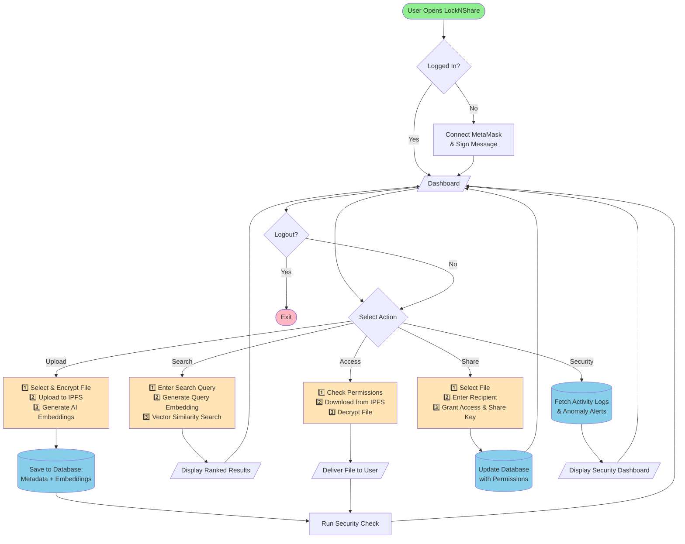
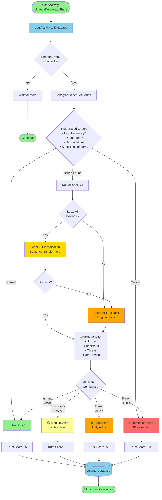
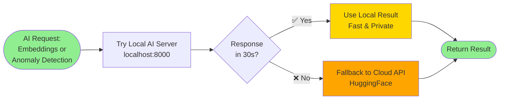

# LockNShare System Flowcharts - Simplified

Clear and concise flowcharts showing the core workflows of LockNShare.

---

## 1. System Overview - Main User Flows



---

## 2. AI Anomaly Detection - Simplified



---

## 3. AI Integration - Local & Cloud Fallback



---

## Quick Reference

### System Components

| Component | Purpose | Technology |
|-----------|---------|------------|
| **Authentication** | Secure login | MetaMask Wallet |
| **Storage** | Decentralized files | IPFS (Pinata) |
| **Database** | Metadata & embeddings | Supabase (PostgreSQL + pgvector) |
| **Encryption** | File security | AES-256-GCM |
| **AI Search** | Semantic search | sentence-transformers |
| **AI Security** | Anomaly detection | BART-large-mnli |

### AI Model Flow

```
User Query/Activity
        ↓
Try: Local AI Server (localhost:8000)
   ├─ Fast (50-300ms)
   ├─ Private (data stays local)
   └─ Free (no API costs)
        ↓ (if fails)
Fallback: HuggingFace Cloud API
   ├─ Reliable (always available)
   ├─ Slower (500-2000ms)
   └─ Requires API key
        ↓
Return Result to User
```

### Security Levels

| Level | Trigger | Action | Trust Impact |
|-------|---------|--------|--------------|
| ✅ **Normal** | AI: >80% normal | Log only | +5 |
| 🟡 **Medium** | AI: >50% suspicious | Notify user | -25 |
| 🟠 **High** | AI: >50% threat | Notify admin | -50 |
| 🔴 **Critical** | Rules + AI: breach | Block action | -100 |

### Shape Legend

- ⬭ **Rounded** = Start/End
- ▭ **Rectangle** = Process (can contain multiple steps)
- ◇ **Diamond** = Decision point
- ▱ **Parallelogram** = User input/output
- ⬮ **Cylinder** = Database operation

---

## Architecture Overview

```
┌─────────────────────────────────────────┐
│           User Browser                  │
│  ┌──────────────────────────────────┐   │
│  │     Next.js Frontend             │   │
│  │  (React + TypeScript)            │   │
│  └──────────────┬───────────────────┘   │
└─────────────────┼───────────────────────┘
                  │
        ┌─────────┼─────────┐
        │         │         │
   ┌────▼───┐ ┌──▼───┐ ┌──▼─────┐
   │Supabase│ │Pinata│ │AI Server│
   │  DB +  │ │(IPFS)│ │  Local  │
   │ Vector │ └──────┘ │   OR    │
   └────────┘          │ Cloud   │
                       └────┬────┘
                            │ (fallback)
                       ┌────▼────┐
                       │HuggingFace│
                       │Cloud API│
                       └─────────┘
```

---

*Simplified flowcharts showing core LockNShare workflows - November 2025*
